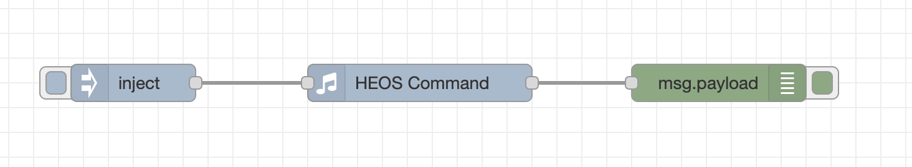
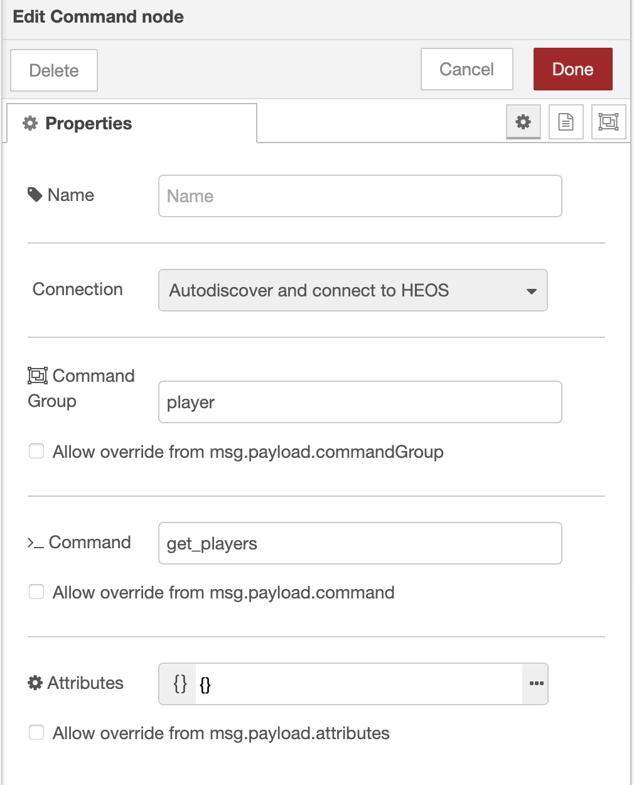
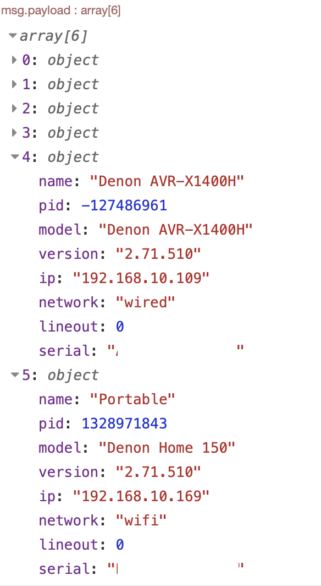
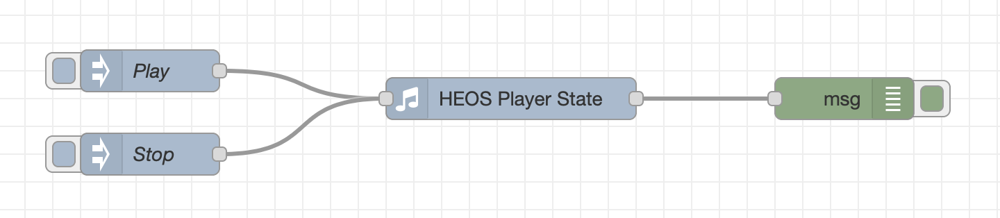
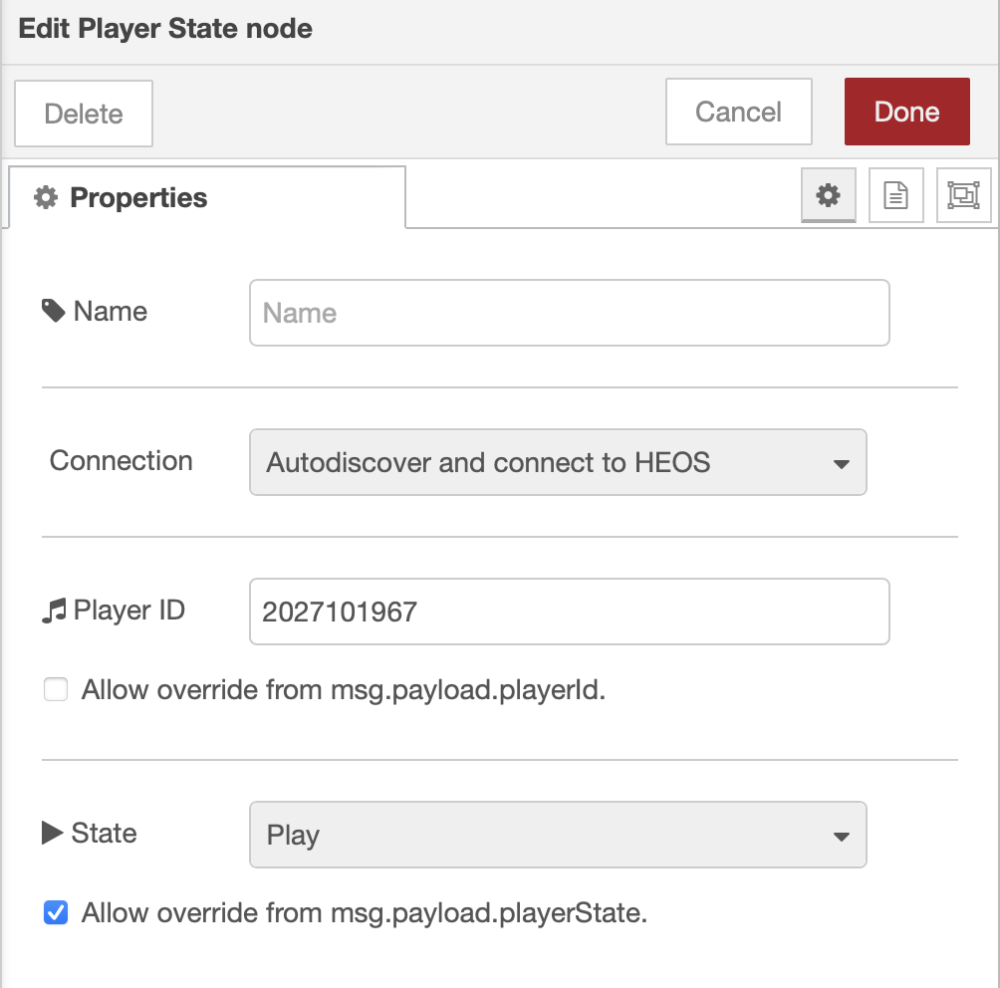
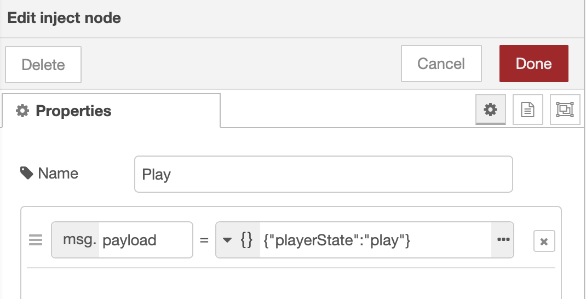
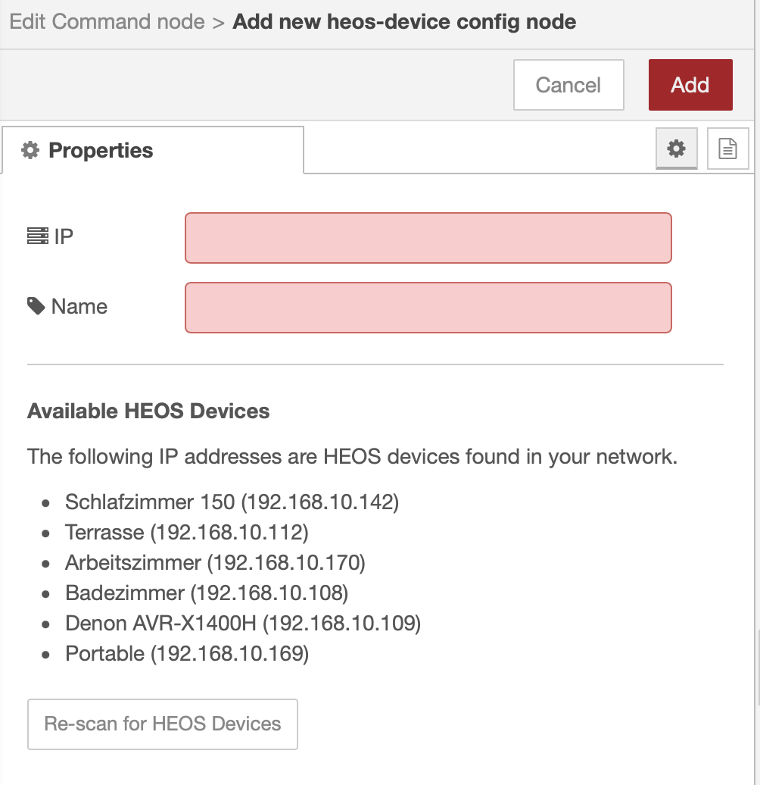

# Quickstart - How to setup your first HEOS flow

With this quickstart you should be able to setup your first HEOS flow successfully in a few minutes.

Follow this steps:

* [1. Get Players in your Network](#1-get-players)
* [2. Play and Stop a Player](#2-play-and-stop-a-player)
* [3. Configure a Gateway (optional)](#3-configure-a-gateway-optional)

## 1. Get Players in your Network

The HEOS commands are not send to a HEOS devices with an IP adresses. Instead commands are sent to a player that can be identified by its player ID.

So it is important for you to get the IDs of all players in your network.

Build a simple flow with a `HEOS Command` node that is triggered by a manual inject and forward the output to a debug node that prints `msg.payload`.

Configure the `HEOS Command` node with the Command Group `player` and the Command `get_players`. Leave Attributes blank or with an empty JSON object.

Trigger the injection and watch the debug output.

The `payload` of the output is a JSON array listing all available players in your network. Use the player ID in the `pid` attribute for sending commands to a specific player.

## 2. Play and Stop a Player

Build a flow with a `HEOS Player State` node that is triggered by two manual inject and forward the output to a debug node that prints the complete `msg` object.

Configure the `HEOS Player State` node with a player ID from step 1 and the a state. Select the checkbox to allow the state to be overridden by the incoming `payload.playerState´ attribute.

Configure the `Inject` nodes to send playerStates via the `msg.payload`.playerState attribute. One of the inject should send the `play` command (see screenshot) and the other should send a `stop` command.

Trigger the injection nodes to play and stop the music.

Watch the debug output. There is no `msg.payload` because the HEOS command does not have a specific data response. But the metadata of the HEOS response is found in `msg.heos`.

## 3. Configure a Gateway (optional)

HEOS devices can be autodiscovered in the network. So there is no need to configure a gateway if your Node-RED installation has access to your network and can search for HEOS devices.

When using the nodes in your flows you can choose between autodiscovering and manual connection.

If you want to connect to a specific device instead of using autodiscover set the *Connection* to *Connect to a specific device*.

In the device configuration you can enter the specific IP adresse and define a name.
All autodiscovered devices in your network are listed at the bottom of the form so you can use any of this devices.

